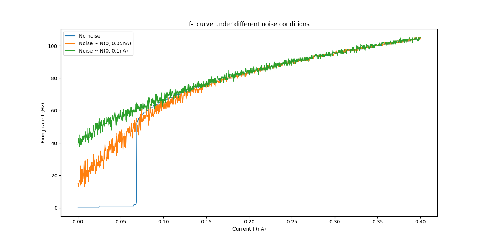
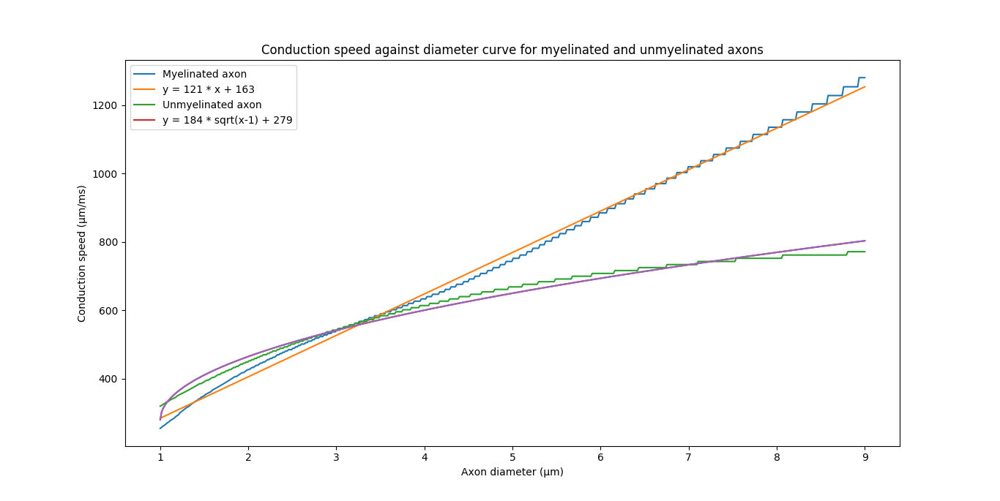
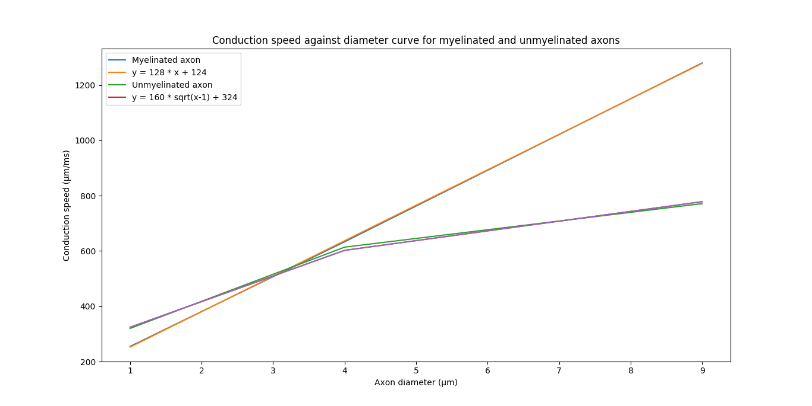

# Neural Prosthesis - Homework 1 
*Author : Johan Medrano - ID 0645241*

Experiments presented in this report have been conducted using the [Python module interfacing NEURON](https://neuron.yale.edu/neuron/static/docs/neuronpython/). 

## 1. Influence of an input noise on the firing rate of a neuron 

The full code related to this section wan be found in the file np1.py. Only some important parts will be hilighted in this part. 

### Introduction

The goal here is to demonstrate the linearization of the firing rate due to the presence of noise in input of a soma. To do this, we will use three different somas, each using the same Hogkin-Huxley model for the membrane. To each soma will be connected a current clamp (*IClamp* in NEURON).

The former one will be stimulated with a simple current step, while the second and third ones will receive the same current step cumulated with different Gaussian noises (zero-mean, *0.05nA* and *0.1nA* standard deviation, respectively). 

### A. Model creation and tuning

As we are more interested in qualitative results than quantitative ones, we use NEURON default parameters for our Hodgkin-Huxley model for simplicity reasons. The diameter, length and axial resistance of the soma have been changed accordingly to [this tutorial](http://web.mit.edu/neuron_v7.4/nrntuthtml/tutorial/tutA.html). 

Therefore, the model parameters are the following : 
* $\bar{g_{Na}} =120\ mS/cm^2$
* $\bar{g_K} = 36\ mS/cm^2$
* $\bar{g_L} = 0.3\ mS/cm^2$
* $E_{Na} = 50\ mV$
* $E_K = -77\ mV$
* $E_L = -54.3\ mV$ 
* $C_m = 1µf/cm2$
* $d = 18.8µm$ 
* $L = 18.8µm$
* $Ra = 123Ω.cm$
* $nseg = 1$ 

Note that, as the soma is small and we do not care about spatial accuracy, we only use one segment. 

The implementation of the model is shown below. Four different vectors are used to record the time and reference voltage of each soma. 


```python
# Create 3 soma, one for each kind of simulation (1 clean clamp, 2 noisy)
soma = [h.Section(name='soma%d'%(i)) for i in range(3)]

v_vec = []
for s in soma: 
    # Tune the soma, inserting HH model
    s.insert('hh')
    # Change diameter, length and axial resistance
    s.L = 18.8
    s(0.5).diam = 18.8
    s.Ra = 123.
    # Some output to check the good configuration
    h.psection(sec = s)

    # Create a vector recording the membrane reversal potential during the simulation 
    v = h.Vector() 
    v.record(s(0.5)._ref_v)
    v_vec.append(v)

# Get a time vector
t_vec = h.Vector()
t_vec.record(h._ref_t)
```

Then we set the parameters of the simulation. We evaluate 1,000 different currents values, varying between *0nA* and *0.4nA*. 
The duration of the simulation, which is also the duration of the current step, is set to $1,000ms$

### B. Stimulating the clamps

Clamps are created and attached to the soma. The current stimuli is not totally defined before the simulation step. For noisy clamps, we manually play a serie of current values in the clamp. 

The noisy step is generated using the code below. The main concern is to not overpass 2,000Hz, as stipulated in the assignement (legend of the image B). 

Thus, a noise of 2,000 points (in the case of a 1-second simulation) is firstly generated using numpy's Gaussian random number generator, with a predifined standard deviation. We then take the inverse-FFT of the FFT of this signal, to cast the 2,000-points signal to a *N*-points signal without adding higher frequencies. Then the noise signal is scaled and shifted to have a mean of zero and a desired standard deviation. 

Then this signal is added to a simple step with the desired shape. 


```python
# Function make_clamp_noisy creates a clamp with a defined amplitude and noise standard 
# deviation (noise_amp)
def make_step_noisy(amp, noise_amp, delay, duration): 
    N = int((delay + duration) / h.dt)
    # Noise bandwith is limited to 2000Hz
    noise0 = np.random.normal(0., noise_amp, int( 2000*(delay + duration)*1e-3))   
    # Use fft and ifft to scale the number of points
    noise = np.real(scfft.ifft(scfft.rfft(noise0), N))                  
    # Rescale the noise
    noise = (noise - np.mean(noise)) * noise_amp/np.std(noise)                     

    # Create a clean clamp
    clean_step = np.array(
        [0 if t < delay else amp for t in np.linspace(0, delay + duration, N)])

    #print("mean %f; std %f"%(np.mean(noise), np.std(noise)))
    return noise + clean_step
```

### C. Counting spikes

The next step is to create a function to automatically count the neuronal spikes during the stimulation, to be able to record the firing rate for different stimulation currents. 
We have many different ways to do so, but the idea is to be able to accurately distinguish the spikes from the voltage waves appearing for a current under the firing current threshold. 

Here, we compute the time first-order derivative of the voltage, $\frac{dV}{dt}$. Then, we try to find a significant increase of the reversal potential, such as $\frac{dV}{dt}(t) > threshold$. To be sure to count the spike only once, we just count the point $t^*$ such as $\frac{dV}{dt}(t^*) \approx threshold$ during an increase of the potential. This point is found by making a linear interpolation : we find $t$ such as $\frac{dV}{dt}(t) < threshold$ and $\frac{dV}{dt}(t + \delta t) > threshold$, and we interpolate $t^* = \frac{t + (t+\delta t)}{2}$.

By using experimental parameter fitting, we found that a threshold of *85 mV/ms* was a good value, well discriminative and counting all the spike for a input current under *0.4 nA*. This parameter will be use for the following parts.


```python
# Function get_spikes_count counts the number of spikes 
def get_spikes_count(v_vec, t_vec, thresh=25): 
    dv_vec = [(v_vec[i+1]-v_vec[i])/(t_vec[i+1]-t_vec[i]) for i in range(len(t_vec) - 1)]
    # dt_vec = [(t_vec[i] + t_vec[i+1])/2 for i in range(len(t_vec) - 1)]
    # plt.plot(dt_vec, dv_vec)
    # plt.show()
    spikes_count = np.sum(
        [dv_vec[i]<thresh and dv_vec[i+1]>thresh for i in range(len(dv_vec) - 1)])
    
    # The spikes count can be converted in Hertz, and is Hertz for duration = 1000
    return spikes_count
```

### D. Putting everything together

The code section below presents the full loop used generate data for differents current. Clamps are firstly configured with the current value of the loop, then the simulation is ran and voltages are recorded for each soma. After the loop, voltages are post-processed to get the number of spikes, which is also the firing rate in Hertz when the simulation duration is *1 sec.*.


```python
voltages =[[],[],[]]
# Loop other all the current steps
for current in np.linspace(min_curr, max_curr, res): 
    # Make a step with 2 different noises for this particular current 
    v_05 = make_step_noisy(current,0.05, delay, duration)
    v_1 = make_step_noisy(current,.1, delay, duration) 

    # Assign it to the vector played in amp
    for i in range(len(v_05)):
        clamp_vec[0].x[i] = v_05[i]
        clamp_vec[1].x[i] = v_1[i]

    # Configure the clean clamp
    stim_clean.amp = current

    # Run the simulation 
    h.run() 

    # Store the voltages records
    for i in range(len(voltages)): 
        c = h.Vector() 
        c.copy(v_vec[i])
        voltages[i].append(c)


spikes_count = [[], [], []]
# Count the spikes for each voltage recorded
for i in range(len(spikes_count)): 
    for c in range(res): 
        spikes_count[i].append(get_spikes_count(voltages[i][c], t_vec)) 
```

### E. Results and discussion

The obtained frequency-current curve under different noise conditions is presented below. We can see that the Gaussian noise has the effect of linearizing the behaviour of the soma. The discontinuitie of the current threshold (around *0.07 nA*) observed on the blue curve, obtain without noise, is replaced by a curve with a continuous mean, as observed on the orange and green curves. The standard deviation of the noise, which determines its "amplitude", makes the curve be more linear by giving higher fire rate values for the smaller currents. 

It is important to notice that the way of calculating the firing rate is not totally correct, which explains the values of *1 Hz* observed on the blue curve, before the threshold : only one spike has been counted on the period, so the firing rate has been extrapolated to be *1 Hz*.

Note also that the firing rate on the orange and green curves in noisy. This is due to the limited time of the simulation, and the potential bias in the data generated by the random number generator.



## 2. Influence of the myelin on the conduction speed of an axon

The full code related to this section wan be found in the file np2.py. Only some important parts will be hilighted in this document. 

### Introduction

In this part, the goal is to hilight the changement of behaviour of an axon, depending on the presence or not of myelin. 
The idea is put in evidence that the saltatory conduction of the action potential in the myelinated axon makes the conduction speed vary linearly with the diameter of the axon, while its vary proportionnaly to the square root of the diameter for unmyelinated axons. This is an important property making the communications faster between neurons.

Hence, to investigate this, we measure the conduction speed of both myelinated and unmyelinated axons for different diameters. Using linear regression, we show the correlation between diameter and conduction speed. 

### A. Myelinated and unmyelinated axons models

The dimension of the axons are given in the subject : axons have a total length of *1.504 mm*, and a diameter varying betweend *1 µm* and *9 µm*. 

#### Myelinated axon model

The myelinated axon model is composed of 7 nodes : 4 Ranvier nodes, and 3 internodal segments. 

The Ranvier nodes are the part of the axon without myelin, thus, their membrane reversal potential is modeled by an Hodgkin-Huxley model. Model parameters are the same as the one presented in Part 1., for the modelisation of the soma's membrane, because the quantitative results are not our main focus. The length of Ranvier nodes is set to *1 µm*.

The internodal segments are the myelinated parts. Myelin works as an insulator, so we modeled it with a passive channel with a infinite resistivity, so zero conductivity. We can find in [this thesis](https://pdfs.semanticscholar.org/a622/57ca2a4024a2165cad8384df388f16208f31.pdf) (page 30) that the value of resistivity for myelin is on the scale of *MΩ*. Even if we are not modeling their frog axon, this gaves an idea of scale and justifies the negligeable error done by setting the membrane conductivity to *0.0 S/cm2*. Its Nernst potential has been set to *-65mV*, after experimental parameter fitting.  
The length of the internodal segments is set to *500 µm*. 

We create a function building an axon with a desired diameter and number of segments for each node, as presented below. 


```python
# Function make_myelinated_axon creates an axon with myelin
def make_myelinated_axon(diameter, nseg=3, innode_len=500, 
        ranvier_len=1, n_nodes=4, n_innode=3, tag=None):
    if tag is None: 
        tag = np.random.randint(0,9)
    axon = []
    
    for i in range(n_innode + n_nodes): 

        if i % 2 == 0: 
            # Create a Ranvier Node 
            r = h.Section(name='ranvier%d%d'%(tag,i))
            # Configure the section 
            r(0.5).diam = diameter
            r.nseg = nseg
            r.Ra = 123.
            r.L = ranvier_len

            # A Ranvier node is a scection with a HH model
            r.insert('hh')

            if i > 0: 
                # Connect it to the previous element
                r.connect(axon[-1](1))
            axon.append(r)
            
        if i % 2 == 1: 
            # Create a section surrounded by myelin 
            m = h.Section(name='myelin%d%d'%(tag,i))
            # Configure the section 
            m(0.5).diam = diameter
            m.nseg = nseg
            m.Ra = 123.
            m.L = innode_len

            # Insert a passive channel 
            m.insert('pas')
            # Our assumption is the myelin is totally insulator
            m.g_pas = 0.000
            m.e_pas = -65

            # Connect it to the previous element
            m.connect(axon[-1](1))
            axon.append(m)  

    return axon
```

#### Unmyelinated axon model

The model for the unmyelinated axon is quite simpler : it only constists in a long section for which the reversal potential is modeled by an Hodkin-Huxley model. 
Parameters used for the membrane model are the same as the ones used above for the Ranvier node : as we want to show that myelin covering parts of the axon (uncovered parts are the Ranvier nodes) makes the conduction behave differently, the base models of the axon's membrane have to be the same.  

We create a function to create an unmyelinated axon with a desired diameter and number of segments using the Ranvier node part of the above function. 

### B. Getting the spike time to compute the conduction speed

During the simulation, we will record the potential for each segment of the two axons. The location of each record will be known, thus, only the travel time of the action potential is required to compute its speed.

We tried several methods to get the time at which the action potential arrived at a specific location, and arbitrarly kept the one presenting the best results. We compute the second order discrete derivative of the recorded potential, and find the first peak. This peak happens when the reversal potential has the highest acceleration. 

Using this method the rising time due to the capacitive effect of the membrane have a small effect on the results. The motivation is that the capacitance effect will probably already have an effect on the conduction and will show up at an higher scale, so it does not have to be counted in the measures.  

The function computing the time of the spikes is presented below. 


```python
# Function get_spike_time gets the time at which the derivative  
def get_spike_time(v_vec, t_vec):
    # First order derivative
    dt_vec = [(t_vec[i] ) for i in range(len(t_vec) - 1)]
    dv_vec = [(v_vec[i+1]-v_vec[i])/(t_vec[i+1]-t_vec[i]) for i in range(len(t_vec) - 1)]

    # Second order derivative
    dv2_vec = [(dv_vec[i+1] - dv_vec[i])/(dt_vec[i+1]-dt_vec[i])
                   for i in range(len(dt_vec) - 1)]
    dt2_vec = [(dt_vec[i]) for i in range(len(dt_vec) - 1)]

    return dt2_vec[np.argmax(dv2_vec)]
```

### C. Simulation loop and linear regression 

The idea is to evaluate the travel speed for different values of diameter, and then use linear regression to fit two differents model on our data. 

A current clamp is attached to one extremity of each axon. After *1 ms*, a strong current pulse of *6 nA* is set during *2 ms*. We measure the travel time as the time between the appearance of the spike on the first segment and the arrival at the end of the axon, on the last segment. As the total length if the axon is known, we can easily get the mean travel speed, which is recorded for each axon diameter. 
We iterate over 500 values of diameters between *1 µm* and *9 µm*.

The myelinated axon is build using 15 segments per sections, for a total of 105 segments. The unique section of the unmyelinated axon has been defined into the same amount of segments. The core of the loop does not present a real interest and is not included in this report. 

#### Apparté : linear regression 

We then use linear regression with L2 regularisation to find a model $\Phi(\textbf{x})\ \textbf{w}$ minimizing the Least Square Error with our data, i.e. : $$\textbf{w}^* = argmin_\textbf{w}\ LSE_{L2} = argmin_\textbf{w}\ ||\textbf{y} - \Phi(\textbf{x}) \textbf{w}||² + \lambda\Phi(\textbf{x})^T \Phi(\textbf{x})$$

where $\textbf{y}$ is a vector of speed values and $\textbf{x}$ a vector of diameters.$\Phi(x)$ is the design matrix, thus $\Phi(\textbf{x}) = [1\ \textbf{x}]$ if we want to regress a line, and $\Phi(\textbf{x}) = [1\ \sqrt{\textbf{x}}]$ if we regress a model varying with the square root of x. $\lambda$ is a regularization term used to avoid overfitting. 

The optimal solution of this problem is : 
$$ \textbf{w}^* = (\Phi(\textbf{x})^T\Phi(\textbf{x}) + \lambda.I)^{-1}\Phi(\textbf{x})^T \textbf{y}$$ 

For inference, our model will then be either $y = x.w_1 + w_0$ or $y = \sqrt{x}.w_1 + w_0$, depending on the design matrix used. The code preforming these operations is shown below.

For practical reasons, the square-root kernel used in the linear regression of the unmyelinated axon has been shifted by 1, and is $\sqrt{x - 1}$. The motivation is to make the square-root be 0 at the first simulation step, because the curve better fits the data and this optimization is beyond the scope of the linear regression method.


```python
# Function linreg_2params performs linear regression with a 2-columns design matrix 
# parametered by a kernel
def linreg_2params(x, y, kernel, lambda_l2=1e-3): 
    assert(callable(kernel))
    phi = np.array([[1, kernel(v)] for v in x])
    w = np.dot(np.dot(
            np.linalg.pinv(np.dot(phi.transpose(), phi) + lambda_l2 * np.eye(2)), 
            phi.transpose()), y)
    return w

# Model parameters - Optimum of LSE with L2 
w_myelinated = linreg_2params(diams, speeds_1, lambda x:x)
w_unmyelinated = linreg_2params(diams, speeds_2, lambda x: np.sqrt(x-1))

# Inference models
speed_myelinated_reg = lambda x : w_myelinated[0] + x * w_myelinated[1]
speed_unmyelinated_reg = lambda x : w_unmyelinated[0] + np.sqrt(x-1) * w_unmyelinated[1]
```

### D. Results and discussion  

The results obtained and the curves fitted with linear regression are shown in the figure below. We can see that the curve for the myelinated is not perfectly linear, but behaves as linear while looked at a large scale. 

The left part of the graph seems strange, because the unmyelinated conduction appears to be faster than the myelinated one. The author has no concrete explanation for this phenomena. This can come from a modeling error in the parameters used for the Hodgkin-Huxley models, which would not be biologically plausible when connected with the internodes section in the myelinated axon, resulting in strange behaviour for small diameters.   

However, when the axon diameter is bigger than *3 µm* the myelinated axon becomes faster, and the gap between the speeds keeps increasing with the diameter. We can there say that the myelinated axon provides an higher conduction speed, thanks to saltatory conduction.    

The second figure below is showing the results obtained for the subjects diameters, *1µm*, *4µm* and *9µm*. We can see that the linear regression seems to be more accurate with these data. 

To further confirm the speed-against-diameter model one can build a more accurate machine learning algorithm in order to find the right model for the data. 
The simulation also need to be improved, using real world parameters to model the axons.  




